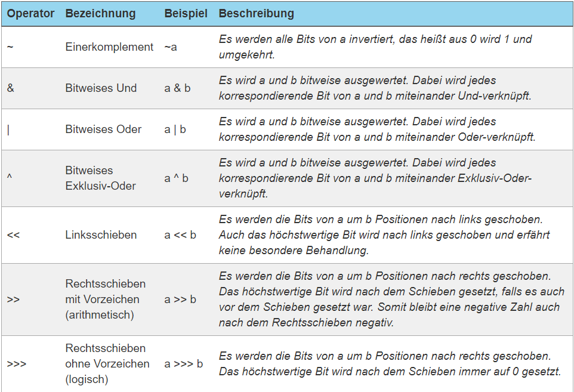
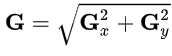

# ImageProcessor

## 1)
Implementiere die Methode `loadImage`. Valdiere mit:
- `givenAValidFilePath_whenLoadImage_returnBufferedImage`
- `givenANonValidFilePath_whenLoadImage_returnNull`

####Tipp: 
Laden eines Bildes: `BufferedImage img=ImageIO.read(new File(PATH))`

## 2)
Implementiere die Methode `getGrayscaleValueFromPixel(BufferedImage img, int y, int x)`. Dabei sollen nicht gültige Parameter (z.B. y<0 oder y>Bildhöhe oder img gleich `null`, etc.) zu einer IllegalArgumentException führen. Validiere mit:

- `givenValidParams_whenGetGrayscaleValueFromPixel_returnGrayscaleValue`
- `givenInvalidParams_whenGetGrayscaleValueFromPixel_throwsException`

####Tipps:
- Farbwerte eines Pixels : `img.getRGB(x, y)` --> liefert eine 32 Bit umfassende binäre Darstellung der Farbwerte als `int` z.B.: `11111111000011000000111000001001`. 
    - Jeweils 8 Bit in folgender Reihenfolge: alpha, rot, gelb, blau. 
- Um an die jeweiligen Bits zu kommen, benötigen wir Bit-Operatoren:
  
  
  
- Blau-Wert: Wir brauchen nur die 8 Bits ganz rechts. Also  nutzen wir das und mit `11111111` dargestellt in Hexadezimal: `img.getRGB(x, y) & 0xFF` 
  
- Grün-Wert: Die 8 Bits links neben den Blauen sind gefragt, also schieben wir einfach alles 8 Bits nach rechts und nehme dann 8 Bits die ganz rechts stehen: `img.getRGB(x, y) >> 8 & 255`
  
- Rot-Wert: Die 8 Bits links neben den Grünen sind gefragt, also schieben wir einfach alles 16 Bits nach rechts und nehme dann 8 Bits die ganz rechts stehen: `img.getRGB(x, y) >> 16 & 255`
  
- Das Ergebnis soll ja ein Graustufenbild sein. Der Graustufenwert eines Pixels wäre also der Durchnitt von Rot, Grün und Blau.
  
## 3) Convert
Implementiere die Methode `convertImageToGraycaleArray(Buffered Image)`. Validiere mit:
- `givenImage_whenConvertImageToGraycaleArray_returnGrayscaleArray`
- `givenNullImage_whenConvertImageToGraycaleArray_throwsException`

####Tipp:
- Höhe und Breite eins Bildes: `img.getHeight() img.getWidth()`
 
 
## 4) Threshold 
Implementiere die Methode `threshold(int[][] pixels, int thresholdValue)`. Jeder Pixel der einen Grauwert unterhalb des `thresholdValue` hat wird auf 0 gesetzt.  
 
## 5) Soebel
Jetzt kommt eine Kantendetektion mittels des Soebel-Algorithmus. Der Algorithmus nutzt eine Faltung mittels einer 3×3-Matrix (Faltungsmatrix), die aus dem Originalbild ein Gradienten-Bild erzeugt. Mit diesem werden hohe Frequenzen im Bild mit Grauwerten dargestellt. Die Bereiche der größten Intensität sind dort, wo sich die Helligkeit des Originalbildes am stärksten ändert und somit die größten Kanten darstellt. Daher wird zumeist nach der Faltung mit dem Sobeloperator eine Schwellwert-Funktion angewandt. Der Algorithmus kann allerdings auch auf andere zweidimensionale Signale angewandt werden.

Aus dem Originalbild wird für jeden Bildpunkt immer nur ein Ausschnitt, genauer gesagt die Umgebung des zu betrachtenden Punktes, verwendet. Nun werden mittels der Sobeloperatoren `sx` und `sy` die "gefalteten" Resultate `gx` und `gy` berechnet.

siehe -> https://www.youtube.com/watch?v=uihBwtPIBxM

Sind `gx` und `gy` berechnet geht es weiter: 

`g` ist dann der neue Graustufenwert des Pixels.

Validiere mit:
- `givenPixelArray_whenSoebel_returnSoebelFilteredArray`
- `givenNullArray_whenSoebel_throwsException`