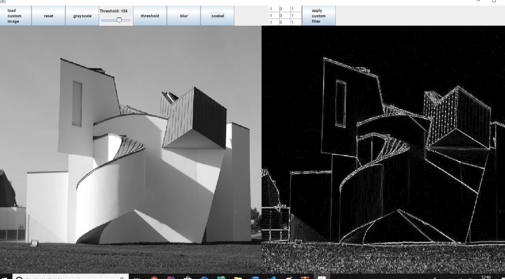
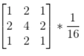
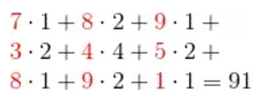

# ImageProcessor ******

Ale Aufgaben können neben den Tests auch mittels der Klasse ImageProcessorUI getestet werden. Hier eine kleine Vorschau:

 

## 1)
Implementiere die Methode `loadImage`. Valdiere mit:
- `givenAValidFilePath_whenLoadImage_returnBufferedImage`
- `givenANonValidFilePath_whenLoadImage_returnNull`

####Tipp: 
Laden eines Bildes: `BufferedImage img=ImageIO.read(new File(PATH))`

## 2)
Implementiere die Methode `getGrayscaleValueFromPixel(BufferedImage img, int y, int x)`. Dabei sollen nicht gültige Parameter (z.B. y<0 oder y>Bildhöhe oder img gleich `null`, etc.) zu einer IllegalArgumentException führen. Validiere mit:

- `givenValidParams_whenGetGrayscaleValueFromPixel_returnGrayscaleValue`
- `givenInvalidParams_whenGetGrayscaleValueFromPixel_throwsException`

####Tipps:
- Farbwerte eines Pixels : `img.getRGB(x, y)` --> liefert eine 32 Bit umfassende binäre Darstellung der Farbwerte als `int` z.B.: `11111111000011000000111000001001`. 
    - Jeweils 8 Bit in folgender Reihenfolge: alpha, rot, gelb, blau. 
- Um an die jeweiligen Bits zu kommen, benötigen wir Bit-Operatoren:
  
  
  
- Blau-Wert: Wir brauchen nur die 8 Bits ganz rechts. Also  nutzen wir das und mit `11111111` dargestellt in Hexadezimal: `img.getRGB(x, y) & 0xFF` 
  
- Grün-Wert: Die 8 Bits links neben den Blauen sind gefragt, also schieben wir einfach alles 8 Bits nach rechts und nehme dann 8 Bits die ganz rechts stehen: `img.getRGB(x, y) >> 8 & 255`
  
- Rot-Wert: Die 8 Bits links neben den Grünen sind gefragt, also schieben wir einfach alles 16 Bits nach rechts und nehme dann 8 Bits die ganz rechts stehen: `img.getRGB(x, y) >> 16 & 255`
  
- Das Ergebnis soll ja ein Graustufenbild sein. Der Graustufenwert eines Pixels wäre also der Durchnitt von Rot, Grün und Blau.
  
## 3) convert to array
Implementiere die Methode `convertImageToGraycaleArray(Buffered Image)`. Validiere mit:
- `givenImage_whenConvertImageToGraycaleArray_returnGrayscaleArray`
- `givenNullImage_whenConvertImageToGraycaleArray_throwsException`

####Tipp:
- Höhe und Breite eins Bildes: `img.getHeight() img.getWidth()`
 
## 4) convert to image
Implementiere die Methode `convertGrayscaleArrayToImage`. Hier muss für jeden Pixel der Grau-Wert wieder zu eine RGB-Wert umgewandelt werden. Angenommen der Grauwert hat das Bitmuster `10001101`, dann müsste folgender RGB-Wert gesetzt werden: `100011011000110110001101`, also einfach für alle drei Farbkanäle mit dem gleichen Grauwert. Dies kann recht einfach mittels Bitshifting und dem Oder-Operator erreicht werden. 

Hier ein Beispiel: 
- `pixel` : `10001101`
- `pixel << 8` : `0000000010001101`
- `pixel << 16` --> `000000000000000010001101`

Wenn man diese drei Ergebnisse mit dem Bit-Oder-Operator verbindet, erhält man das gewünschte Ergebnis, welches mit `setRGB(x, y, pixelValue)` in ein BufferedImage gesetzt werden kann. Das BufferedImage sollte wie folgt erzeugt werden: `new BufferedImage(width, height, BufferedImage.TYPE_BYTE_GRAY)`. Validiere mit:

- `givenNull_whenConvertGrayscaleArrayToImage_throwException`
- `givenGrayscalePixels_whenConvertGrayscaleArrayToImage_returnImage`

## 5) Threshold 
Implementiere die Methode `threshold(int[][] pixels, int thresholdValue)`. Jeder Pixel der einen Grauwert unterhalb des `thresholdValue` hat wird auf 0 gesetzt.  

Validiere mit:
- `givenInvalidParams_whenThreshold_ThrowsException`
- `givenArray_whenThreshold_returnThresholdedArray`

## 6) Gaussian Blur 
Der Filter wird benutzt, um z.B. Kanten zu glätten, wobei auch die Werte 
der umliegenden Punkte mit berücksichtigt werden. Doch was
 ist genau ein Filter? Im Grund genommen ist ein Filter auch wieder 
 eine Matrix. Und dieser Filter wird auf das Bild angewendet. Hier ein Beispiel:
 
 Gegeben ist folgendes Bild:
 
 
 
 
 Wir möchten folgenden Gaußschen Filter anwenden:


 
Jetzt wird jeder Punkt in der ersten Matrix neu berechnet. Nehmen wir die Position (3, 3) was dem Wert 4 entspricht. Die umliegenden Punkte sind: 7, 8, 9, 3, 5, 8, 9, 1. Wir rechnen:



Und die 91 müssen wir noch durch 16 teilen. Damit haben wir den neuen Wert für die Position (3,3). 
 
Diese Berechnung wird dann für jeden Pixel durchgeführt und es entsteht ein neues Bild (das dem alten Bild natürlich ähnlich aussieht). Die Randpixel werden unverändert übernommen! 

Validiere mit:
- `givenNull_whenGaussianBlur_throwsException`
- `givenPixelArray_whenGaussianBlur_returnBlurredArray`

## 7) Soebel
Jetzt kommt eine Kantendetektion mittels des Soebel-Algorithmus. Der Algorithmus nutzt eine Faltung mittels einer 3×3-Matrix (Faltungsmatrix), die aus dem Originalbild ein Gradienten-Bild erzeugt. Mit diesem werden hohe Frequenzen im Bild mit Grauwerten dargestellt. Die Bereiche der größten Intensität sind dort, wo sich die Helligkeit des Originalbildes am stärksten ändert und somit die größten Kanten darstellt. Daher wird zumeist nach der Faltung mit dem Sobeloperator eine Schwellwert-Funktion angewandt. Der Algorithmus kann allerdings auch auf andere zweidimensionale Signale angewandt werden.

Aus dem Originalbild wird für jeden Bildpunkt immer nur ein Ausschnitt, genauer gesagt die Umgebung des zu betrachtenden Punktes, verwendet. Nun werden mittels der Sobeloperatoren `sx` und `sy` die "gefalteten" Resultate `gx` und `gy` berechnet.


```
int[][] sx = new int[][]{
                {-1, 0, 1},
                {-2, 0, 2},
                {-1, 0, 1}
        };
 
int[][] sy = new int[][]{
                {-1, -2, -1},
                {0, 0, 0},
                {1, 2, 1}
        };
```

siehe -> https://www.youtube.com/watch?v=uihBwtPIBxM

Sind `gx` und `gy` berechnet geht es weiter: 


`g` ist dann der neue Graustufenwert des Pixels.

Das Ergebnisarray ist 2 Zeilen sowie 2 Spalten kleiner, da die Ränder nicht berechnet werden!

Validiere mit:
- `givenPixelArray_whenSoebel_returnSoebelFilteredArray`
- `givenNullArray_whenSoebel_throwsException`

## 8) custom filter
Implementiere die Methode `public int[][] custom(int[][] pixels, int[][] filter)`. Im UI kann ein eigene Filter erstellt werden, der dann - wie beim Gaußschen-Filter - angewendet wird. Wichtig hier: Jetzt mal ohne Tests.